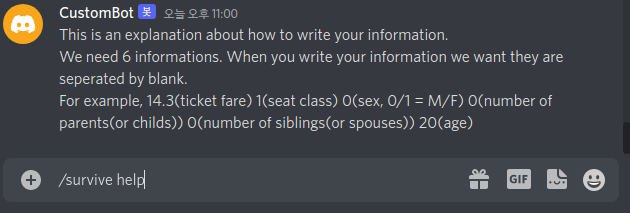
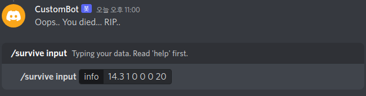

# DiscordTitanicBot
Kaggle에 있는 [__Titanic - Machine Learning from Disaster__](https://www.kaggle.com/competitions/titanic/overview) 의 
데이터를 바탕으로 유저가 입력한 정보를 가지고 타이타닉 사고에서 살아남을 수 있는지 없는지 판단해주는 discord bot입니다.  
## Commands
Bot에서 사용되는 모든 명령어는 __slash command(/)__ 입니다.
- echo: 사용자가 입력한 문장을 그대로 출력하는 명령입니다.
- hello: Bot이 인사 말을 출력합니다.
- survive: 사용자의 입력을 바탕으로 살아남을 수 있는지 없는지 알려줍니다.
    - help: 입력하는 방법을 가르쳐 줍니다.
    - input: 사용자가 타이타닉에 탑승하는 고객에 대한 정보를 입력합니다.
### Command Examples
1. /echo  

2. /hello  

3. /survive help  

4. /survive input  


## Development Environment
- OS: Ubuntu 22.04.1 LTS
- Languages & IDE
    - Node.js: vscode (ver. 1.73.0)
    - Python3: PyCharm 2022.2.3 (Community Edition), Intepreter: Anaconda3
- Additional Installation
    - Node.js
        - npm (ver 8.5.5)
        - discord.js (ver 14.6.0)
        - onnxjs (ver 0.1.8)
    - Python3 (ver 3.10)
        - numpy (ver 1.23.3)
        - pandas (ver 1.4.4)
        - pytorch (ver 1.10.2)

## Project Hierarchy
```
project
|    README.md
|    config.json
|    package.json
|    package-lock.json
|    deploy-commands.js
|    index.js
|
|___ commands
|    |    echo.js
|    |    hello.js
|    |    survive.js
|
|___ events
|    |    interactionCreate.js
|    |    ready.js
|
|___ node_modules
|    |    ...
|
|___ titanic
|    |    train.csv
|    |    dnn.py
|    |    train.py
|    |    convert_to_onnx.py
```