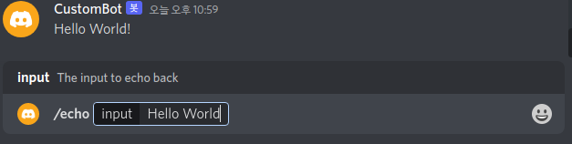
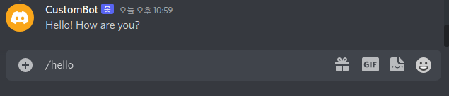

# DiscordBot
Node.js 언어로 만든 discord bot입니다.  
## Commands
Bot에서 사용되는 모든 명령어는 __slash command(/)__ 입니다.
- echo: 사용자가 입력한 문장을 그대로 출력하는 명령입니다.
- hello: Bot이 인사 말을 출력합니다.
### Command Examples
1. /echo  

2. /hello  


## Development Environment
- OS: Ubuntu 22.04.1 LTS
- Languages & IDE
    - Node.js: vscode (ver. 1.73.0)
- Additional Installation
    - Node.js
        - npm (ver 8.5.5)
        - discord.js (ver 14.6.0)

## Project Hierarchy
```
project
|    README.md
|    config.json
|    package.json
|    package-lock.json
|    deploy-commands.js
|    index.js
|
|___ commands
|    |    echo.js
|    |    hello.js
|
|___ events
|    |    interactionCreate.js
|    |    ready.js
|
|___ node_modules
|    |    ...
```